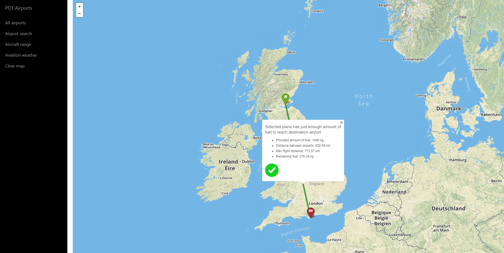

# Overview
This is a simple lightweight application with following set of features:
* Display all airports in Great Britain
* Search airport by name
* Show nearest restaurants and bars surrounding chosen airport
* Calculate whether a selected aircraft can reach destination airport with provided amount of fuel
* Display flight safety on selected flight based on weather

This is it in action: <br/>

<br/>

<br/>

<br/>

<br/>

<br/>

<br/>

The application consists of following parts:
* simple frontend web application client using mapbox.js
* backend application written in node.js
* spatial database (postgreSQL with postgis extension)

# Fronted
The frontend application is a static HTML page (index.html), which shows a basic siderbar with menu and mapbox.js widget. The is used a street map style, because of the ability to zoom on the airpot and show nearest restaurants. Most of the map elements are displayed using Leaflet library, which mapbox.js contains. All relevant frontend code is in index.html. The frontend code is very simple, its only responsibilities are:

* displaying the sidebar panel providing user interaction and calling the appropriate backend APIs
* displaying geo features by overlaying the map with a geojson layer, the geojson is provided directly by backend APIs. Airports are displayed using Leaflet's GeoJson layer. Each airport is represented by a Leaflet marker and polygon, highlited with a color inticating the size of airport area. The color is a gradient of yellow and dark red,where yellow color indicates small airports and dark red big airports. The are also drawn lines with leaflet, displaying flights between airports. All markers, polygons and lines are interactive and can show various popups. 
* detecting weather on selected flight using [OpenWeatherMap API](https://openweathermap.org/api)

The frontend contains these following technologies:
* Bootstrap 4
* Jquery
* Mapbox.js
* Leaflet.awesome-markers library for custom markers

# Backend

Backend application is implemented in Node.js enviroment with usage of Express.js framework. It is responsible for querying geo data, formatting geojsons and data for the sidebar panel. Following files are main components of the backend part of the application. [Pg](https://www.npmjs.com/package/pg) client was used for connection with Postgresql database. 

## Data
Airport data is coming directly from Open Street Maps. I downloaded an extent covering the Great Britain and imported it using the osm2pgsql tool into the standard OSM schema. To speedup the queries I created indexes where it was needed. GeoJSON is generated by using a standard st_asgeojson function, however some postprocessing is necessary (in Server\public\javascripts\postgistogeojson.js) in order to merge all data into a single geojson. Data of airplanes fuel consumption was downloaded from this [source](https://www.airliners.net/forum/viewtopic.php?t=1355819). Then I manually collected remaining data about selected airplanes from the internet. Data were stored into csv format and parsed into SQL Insert commands using C# code located in Plane Loader. 

## Api

**Get all airports in database**

`GET /map/getAllAirports`

**Get array of airport area percentiles, used to determine the color of airport polygons on frontend**

`GET /map/getPercentiles'`

**Get all airports, that satisfies the search name**

`GET /map/getAirport?name=London`

**Get the nearest restaurants and bar of the airport**

`GET /map/getNearestFoodDrink?lon=0.5056&lat=50.56564`

**Get the interpolated points of provided flight line, that will be used for weather API**

`GET /map/getPointsForWeather?sourceId=456489489&destinationId=415189415`

**Get 2 points indicating that plane could make the full range of flight, or 3 points, where the middle points is interpolated point, where the airplane would reach zero fuel**

`GET /map/rangeQuery?sourceId=44481984&destinationId=989511581&maxDistance=236`

### Response

API calls return json responses either in JSON or GeoJSON format.

Example GeoJSON:
```
{
  "features":[
     {
        "geometry":{
           "coordinates":[
             -1.2792383,52.8362611990846
           ],
           "type":"Point"
        }
        "type":"Feature"
     }
  ],
  "properties":{
     "name":"The Roadside Cafe",
     "dist":4064.58662304,
     "amenity":"cafe"
  },
  "type":"FeatureCollection"
}
```